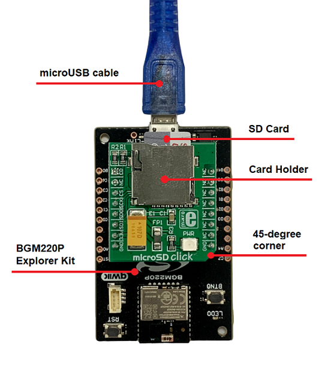
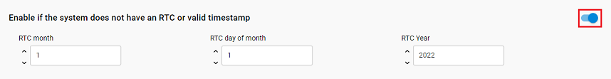

# External Storage - microSD Click (Mikroe) #

## Summary ##

This project aims to implement a hardware driver interacting with an SD Card using the microSD Click board. SD Cards support SDIO or SPI interfaces to communicate; this driver communicates via the SPI interface as SPI is widely available in embedded devices/micro-controllers.

This project integrates FatFS which is one of the most popular file system libraries. File system related abstraction is handled by FatFS, and lower-level functions like the media IO layer are provided by this project's source code. For more information about FatFS, see the following [source](http://elm-chan.org/fsw/ff/doc/appnote.html).

The microSD Click communicates with the target microcontroller over SPI interface that corresponds to the pinout on the mikroBUS™ socket as shown below.

## Table Of Contents ##

- [Required Hardware](#required-hardware)
- [Hardware Connection](#hardware-connection)
- [Setup](#setup)
  - [Create a project based on an example project](#create-a-project-based-on-an-example-project)
  - [Start with an empty example project](#start-with-an-empty-example-project)
- [How It Works](#how-it-works)
- [Report Bugs & Get Support](#report-bugs--get-support)

## Required Hardware ##

- 1x [Silicon Labs BLE Explorer Kit](https://www.silabs.com/development-tools/wireless/bluetooth) based on the EFR32 SoC, such as:
  - [BGM220-EK4314A](https://www.silabs.com/development-tools/wireless/bluetooth/bgm220-explorer-kit)
  - [BG22-EK4108A](https://www.silabs.com/development-tools/wireless/bluetooth/bg22-explorer-kit?tab=overview)
  - [xG24-EK2703A](https://www.silabs.com/development-tools/wireless/efr32xg24-explorer-kit?tab=overview)
  - [xG22-EK2710A](https://www.silabs.com/development-tools/wireless/efr32xg22e-explorer-kit?tab=overview)

  *or*

  1x [Silicon Labs Wi-Fi Development Kit](https://www.silabs.com/development-tools/wireless/wi-fi) based on SiWG917, such as:
  - [SIWX917-DK2605A](https://www.silabs.com/development-tools/wireless/wi-fi/siwx917-dk2605a-wifi-6-bluetooth-le-soc-dev-kit)
  - [SIWX917-RB4338A](https://www.silabs.com/development-tools/wireless/wi-fi/siwx917-rb4338a-wifi-6-bluetooth-le-soc-radio-board) + [Si-MB4002A](https://www.silabs.com/development-tools/wireless/wireless-pro-kit-mainboard?tab=overview)
  - [SiW917Y-EK2708A](https://www.silabs.com/development-tools/wireless/wi-fi/siw917y-ek2708a-explorer-kit?tab=overview)

- 1x [microSD Click board](https://www.mikroe.com/microsd-click)
- 1x microSD card, e.g. microSD card 32 GB

## Hardware Connection ##

The Silicon Labs Explorer Kit boards feature a mikroBUS™ socket, allowing the microSD Click board to connect easily via the mikroBUS header. Ensure that the 45-degree corner of the microSD Click board aligns with the 45-degree white line on the Explorer Kit. The hardware connection is illustrated in the image below.

For the Silicon Labs boards that do not have a mikroBUS™ socket, consider using the Wire Jumpers.

The tables below provide an overview of the pin connections.

**Silicon Labs BLE Explorer Kit:**

| Description | BRD4314A | BRD4108A | BRD2703A | BRD2710A | ↔ | microSD Click |
| --- | --- | --- | --- | --- | --- | --- |
| SPI CS PIN  | PC3 | PC3 | PC0 | PC3 | ↔ | CS  |
| SPI CLK PIN | PC2 | PC2 | PC1 | PC2 | ↔ | SCK |
| SPI RX PIN  | PC1 | PC1 | PC2 | PC1 | ↔ | SDO |
| SPI TX PIN  | PC0 | PC0 | PC3 | PC0 | ↔ | SDI |
| Card Detection | PB0 | PB0 | PB0 | PB0 | ↔ | CD  |

**Silicon Labs Wi-Fi Development Kit:**

> [!IMPORTANT]
> The MISO pin is driven by a tri-stated output from the SDcard. Therefore, a pull-up resistor (e.g., 100k) should be placed on the MISO pin to hold that input into a known state when the SDcard is not selected.

| Description | BRD4338A + BRD4002A | BRD2605A | BRD2708A | ↔ | microSD Click |
| --- | --- | --- | --- | --- | --- |
| RTE_GSPI_MASTER_CLK_PIN  | GPIO_25 [P25] | GPIO_25 [P3]  | GPIO_25 | ↔ | SCK |
| RTE_GSPI_MASTER_MISO_PIN | GPIO_26 [P27] | GPIO_26 [P5]  | GPIO_26 | ↔ | SDO |
| RTE_GSPI_MASTER_MOSI_PIN | GPIO_27 [P29] | GPIO_27 [P7]  | GPIO_27 | ↔ | SDI |
| RTE_GSPI_MASTER_CS0_PIN  | GPIO_28 [P31] | GPIO_28 [P9]  | GPIO_28 | ↔ | CS  |
| Card Detection           | GPIO_46 [P24] | GPIO_10 [P23] | GPIO_29 | ↔ | CD  |

## Setup ##

You can either create a project based on an example project or start with an empty example project.

> [!IMPORTANT]
>
> - Make sure that the [Third Party Hardware Drivers](https://github.com/SiliconLabsSoftware/third_party_hw_drivers_extension) extension is installed as part of the SiSDK. If not, follow [this documentation](https://github.com/SiliconLabsSoftware/third_party_hw_drivers_extension/blob/master/README.md#how-to-add-to-simplicity-studio-ide).
> - **Third Party Hardware Drivers** extension must be enabled for the project to install the required components from this extension.

> [!TIP]
> To show all components in the **Third Party Hardware Drivers** extension, the **Evaluation** quality must be enabled in the Software Component view.

### Create a project based on an example project ###

1. From the Launcher Home, add your device to My Products, click on it, and click on the **EXAMPLE PROJECTS & DEMOS** tab. Find the example project filtering by **microsd**.

2. Click **Create** button on the **Third Party Hardware Drivers - microSD Click (Mikroe)** example. Example project creation dialog pops up -> click Create and Finish and Project should be generated.

   

3. Build and flash this example to the board.

### Start with an empty example project ###

1. Create an "Empty C Project" for the your board using Simplicity Studio v5. Use the default project settings.

2. Copy the file `app/example/mikroe_microsd/app.c` into the project root folder (overwriting the existing file).

3. Open the .slcp file. Select the **SOFTWARE COMPONENTS** tab and install the following components:

   - **If the BLE Explorer Kit is used:**
     - **[Third Party Hardware Drivers] → [Storage] → [microSD - microSD Click (Mikroe)]**
     - **[Third Party Hardware Drivers] → [Storage] → [FatFS - Generic FAT Filesystem]**
     - **[Services] → [IO Stream] → [IO Stream: EUSART]** → with the default instance name: **vcom**
     - **[Application] → [Utility] → [Log]**
     - **[Application] → [Utility] → [Assert]**

   - **If the Wi-Fi Development Kit is used:**
     - **[Application] → [Utility] → [Assert]**
     - **[Third Party Hardware Drivers] → [Storage] → [microSD - microSD Click (Mikroe)]**
     - **[Third Party Hardware Drivers] → [Storage] → [FatFS - Generic FAT Filesystem]** -> turn on *Enable if the system does not have an RTC or valid timestamp*
     

4. Build and flash the project to your device.

## How It Works ##

### API Overview ###

The driver is divided into a FatFs, a Media access interface, and an SPI platform. The FatFs layer is the Filesystem Layer independent of platforms and storage media, it is completely separated from the physical device, such as memory card, hard disk, or any type of storage device. The media access interface is not part of the FatFs module and it needs to be provided by the implementer. FatFs module controls the storage devices via a media access interface. The SPI platform layer provides integration to the host microcontroller hardware-dependent code.

The dependency diagram is shown below.

**FatFS**: provides various filesystem functions for the applications.

- File Access
- Directory Access
- File and Directory Management
- Volume Management and System Configuration

For more information about the APIs of the FatFS module, see the following [source](http://elm-chan.org/fsw/ff/00index_e.html).

**Storage Device Controls Generic Media**: implements the generic media access interface by consuming device-specific storage device control implementations.
**Storage Device Controls SD Card**: implements the storage device control interfaces specific to SD Card.

**Storage Device Controls SD Card Platform**: implements basic interfaces required by the upper Storage Device Control layer. It implements SPI **byte, multibyte, exchange**, and other required functions by consuming platform SPI interfaces. The SPI instance is configurable via a public interface. SPI instance should be provided by passing as a parameter of the sd_card_spi_init() function.

**Silicon Labs Platform**: implements the peripheral driver core.

### Testing ###

This example demonstrates the basic features of the driver as shown below:

Use a terminal program, such as the Console that is integrated into Simplicity Studio or a third-party tool terminal like Tera Term to receive the logs from the virtual COM port. Make sure that A pull-up resistor (e.g., 100k) is placed on the MISO. You should expect a similar output to the one below.

Unmount the SD Card. Use a micro Card Reader to read files from the SD Card on your computer. You should expect a similar output to the one below.

## Report Bugs & Get Support ##

To report bugs in the Application Examples projects, please create a new "Issue" in the "Issues" section of [third_party_hw_drivers_extension](https://github.com/SiliconLabsSoftware/third_party_hw_drivers_extension) repo. Please reference the board, project, and source files associated with the bug, and reference line numbers. If you are proposing a fix, also include information on the proposed fix. Since these examples are provided as-is, there is no guarantee that these examples will be updated to fix these issues.

Questions and comments related to these examples should be made by creating a new "Issue" in the "Issues" section of [third_party_hw_drivers_extension](https://github.com/SiliconLabsSoftware/third_party_hw_drivers_extension) repo.
